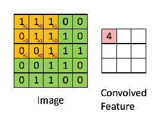

# Todays Speech Recognition Example:  
-Cortana: Windows assistant  
-Siri:    Apple's assistant and apple homepod assistant  
-Google Assistant: Android assistant and Google Home assistant  
-Alexa    Amazon home assistant  

# Common Neural Networks:  
Multilayer perceptron (MLP)  
Convolutional neural network (CNN)  
Recursive neural network (RNN)  
Recurrent neural network (RNN)  
Long short-term memory (LSTM)  
Sequence-to-sequence models  
Shallow neural networks
  
  
#  Deep Speech:  
-Uses a well-optimized RNN training system  
-Does not require phoneme dictionary,  
-Employes multiple GPU's to process thousands of hours of data,  
  
# Redes Feedforward: Introdução
Nas redes  Feedforward as camadas de rede são independentes umas das outras, assim, uma camada pode ter um número arbitrário de nós (sendo que, tipicamente, o número de nós arbitrários tem de ser superior ao de nós de input). Quando aplicadas a funções de aproximação, geralmente existe um input e um output. Por contraste, quando usadas como classificadores, o número de nós de input e output irá corresponder o número de características de input e o número de classes de output, respetivamente. Adicionalmente, terá de ter no mínimo uma camada oculta e todos os nós das camadas têm peso 1.

# Funcionamento das Redes Feedforward
O principal objetivo das redes Feedforward é fazer uma aproximação de uma dada função f. 
Por exemplo, a função y = f(x) atribui a um dado valor de x um valor de y. Uma rede Feedforward define o mapeamento através de uma função y = f(x, θ), aprendendo os valores do parâmetro θ que resultam na melhor função de aproximação.
Estas redes são representadas por uma série de diferentes funções. Cada rede é também acompanhada por um grafo acíclico dirigido: 

Por exemplo, podemos ter três funções, f(1), f(2) e f(3) interligadas formando então f (x) = f(3)(f (2)(f (1)(x))). Neste caso, f(1) é primeira camada de input, f(2) a segunda e f(3) a camada de output.
As camadas entre as camadas de input e output são conhecidas como “camadas ocultas”, sendo que o traning data não expressa o output desejado a estas camadas. A rede pode conter infinitas camadas de camadas ocultas com um qualquer número de unidades. Uma unidade representa um neurónio que obtém o input de unidades de camadas prévias e calcula o seu valor de ativação.
# Porque precisamos de redes Feedforward?
A utilidade no uso das redes Feedforward surge nos modelos lineares estarem limitados a utilizar apenas funções lineares, algo que não acontece com redes neuronais. Quando uma determinada amostra está impossibilitada de ser separada linearmente, os modelos lineares apresentam alguma dificuldade a fazer aproximações, contrastando com a facilidade apresentada nos modelos neuronais. As camadas ocultas são, portanto, usadas para aumentar a “não linearidade” e alterar a representação de uma data amostra para uma melhor generalização de uma função

# RNN(Recurrent neural networks):
Add additional weights to the network to create cycles in the network graph in an effort to maintain an internal state
By adding state to a neural network we will be able to explicitly learn and exploit context in sequence prediction problems,
like humans who can recognize something as they move towards that same thing, machines will also be able to recognize and make predictions base on movement and temporal data.  
In our Case of study the RNN is used to convert input sequences into a sequence of character probabilities for the transcription.

# CNN (Convulutional Neural Netowrks):
In deep learning, a convolutional neural network (CNN, or ConvNet) is a class of deep neural networks, most commonly applied to analyzing visual imagery. They are also known as shift invariant or space invariant artificial neural networks (SIANN), based on their shared-weights architecture and translation invariance characteristics. They have applications in image and video recognition, recommender systems,[3] image classification, medical image analysis, and natural language processing.

# Bibliography:

-https://nordicapis.com/5-best-speech-to-text-apis/  
-https://machinelearningmastery.com/recurrent-neural-network-algorithms-for-deep-learning/  
-https://www.quora.com/Which-neural-network-type-is-best-for-speech-recognition-and-speech-synthesis  
-https://www.coursera.org/lecture/nlp-sequence-models/different-types-of-rnns-BO8PS  
-https://medium.com/towards-artificial-intelligence/introduction-to-the-architecture-of-recurrent-neural-networks-rnns-a277007984b7  
-https://medium.com/@datamonsters/artificial-neural-networks-for-natural-language-processing-part-1-64ca9ebfa3b2   
-https://towardsdatascience.com/beginners-guide-to-understanding-convolutional-neural-networks-ae9ed58bb17d
-https://towardsdatascience.com/feed-forward-neural-networks-c503faa46620
-https://dzone.com/articles/the-very-basic-introduction-to-feed-forward-neural

# CNN (Convolutional Neural Networks) VS RNN(Recurrent neural networks)

In some cases like Image Recognition on which the set of input/output nodes are static basically on every time independent problem CNN is at most the optimal Neural Network option, with the introduction of time as variable RNN comes in handy.  Output for a given input is now not only based on the input at a given time, but also the inputs that came previously. 

# Redes de convolução: Introdução

Na área de redes neuronais, CNN (redes de convolução) são uma das principais categorias para análise e classificação de imagens, como tal o uso deste tipo de rede torna-se bastante reincidente quando o objetivo é detetar objetos, reconhecer individuos ou até ler textos manuscritos.
Na nossa abordagem ao reconhecimento de voz, iremos dissecar a utilidade desta rede quando o assunto de estudo se trata não de uma simples imagem de duas dimensões (alturaxlargura), mas sim de reconhecer uma voz, algo dependente de uma quantidade descomunal de variaveis.

# Convolução

Uma convolução é a primeira camada de acesso a dados, que extrai com base num input uma amostra.
Com essa amostra são depois extrapolados detalhes acerca do input aplicando um filtro/kernel.
Um kernel é uma matrix menor que a matrix de input, também denominada de matrix de convolução, cuja função é iterar a matriz de input
aplicando-lhe um produto.

Quando o objetivo é extrair do output multiplas propriedades usamos vários kernels do mesmo tamanho, de modo a que o resultado destes filtros seja empilhavel.

Numa última fase da convolução é aplicada á matrix filtrada uma função de activação (normalmente sendo esta uma função de ReLu ou de Tanh) com o intuito de deslinearizar o output. 

